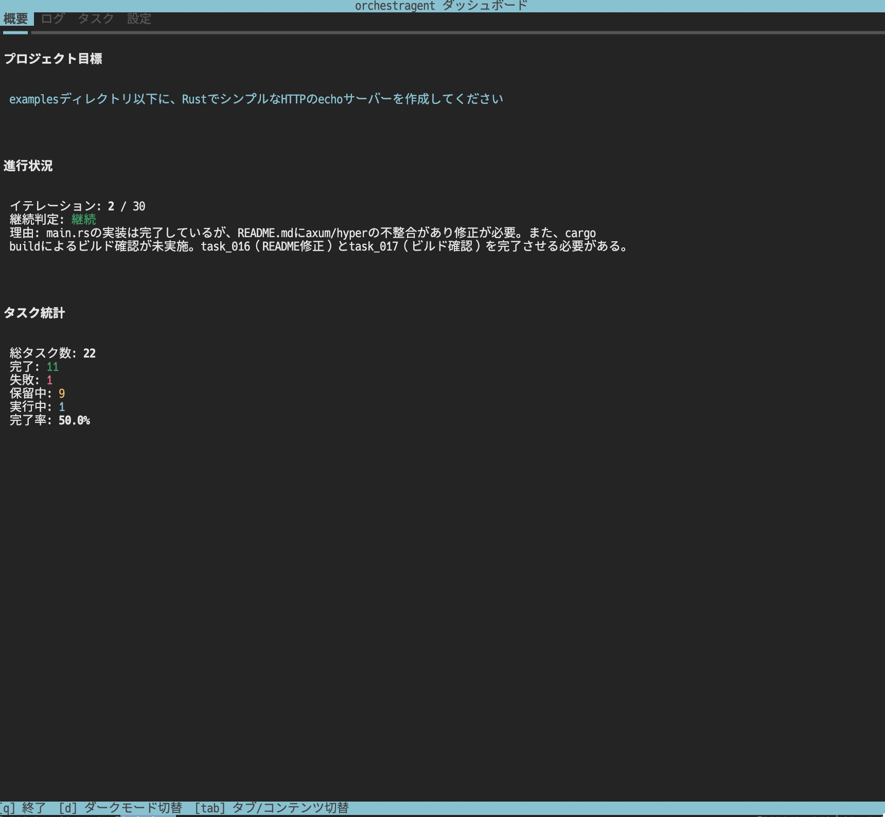

# プランナー・ワーカースタイル自律エージェントシステム

> **⚠️ 開発中**  
> 本プロジェクトは現在開発中です。API・仕様・動作は予告なく変更される可能性があり、不具合が含まれている可能性もあります。

Cursorブログ記事「[長時間稼働する自律型コーディングをスケールさせる](https://cursor.com/ja/blog/scaling-agents)」で紹介されているプランナー・ワーカースタイルのエージェントシステムを、最小構成で実装するプロジェクトです。



## プロジェクト目標

- ✅ 複数エージェント（役割分離：Planner, Worker, Judge）
- ✅ 自律ループ（再計画 → 実行 → 判定）
- ✅ 長時間動作（数時間〜数日）
- ❌ 高スループット（不要）
- ❌ 完全無人運用（不要）

## ドキュメント

### 開発者向けドキュメント

詳細な設計ドキュメントは [`docs/dev/`](./docs/dev/) を参照してください。

- **[要件整理と全体計画](./docs/dev/PLANNING.md)**: プロジェクトの要件と全体計画
- **[技術的詳細と実装上の課題](./docs/dev/TECHNICAL_DETAILS.md)**: 技術的な詳細と課題
- **[プロンプト設計ガイド](./docs/dev/PROMPT_DESIGN.md)**: エージェントのプロンプト設計
- **[Cursor CLIリファレンス](./docs/dev/CURSOR_CLI_REFERENCE.md)**: Cursor CLIの使用方法
- **[抽象化レイヤーの設計](./docs/dev/ARCHITECTURE_DESIGN.md)**: 後からLLM APIに差し替え可能な設計
- **[実行環境の設計](./docs/dev/EXECUTION_ENVIRONMENT.md)**: Sandbox/DevContainerでの実行方法
- **[実装前チェックリスト](./docs/dev/IMPLEMENTATION_CHECKLIST.md)**: 実装開始前の確認項目
- **[ADR（Architecture Decision Records）](./docs/adr/)**: アーキテクチャ決定の記録

## クイックスタート

**最小限の手順で実行したい場合は、[QUICKSTART.md](./QUICKSTART.md)を参照してください。**

**DockerHubにイメージを公開すれば、docker-compose.ymlと.envファイルだけで実行可能です。詳細は[DOCKERHUB.md](./DOCKERHUB.md)を参照してください。**

### 基本的な実行手順（ローカルビルド）

```bash
git clone <repository-url>
cd orchestragent
docker compose build
docker compose run --rm -it agent python main.py --dashboard
```

初回実行時に`.env`ファイルの作成や必要なディレクトリの作成が自動的に行われます。

## 前提条件

### Mac上でDockerを使用する場合

Mac上でDockerを実行する際、ホストのファイルシステムにアクセスする必要がある場合は、**Docker.appにフルディスクアクセス権限を付与**する必要があります。

#### 設定手順

1. **システム設定**を開く
2. **プライバシーとセキュリティ** → **フルディスクアクセス**を選択
3. 左下の鍵アイコンをクリックしてロックを解除
4. **+** ボタンをクリックし、`/Applications/Docker.app` を追加
5. Docker Desktopを再起動

> **注意**: この権限がない場合、コンテナからホストのファイルシステムへのマウントが正しく動作しない可能性があります。

## クイックスタート

### 最小限の手順で実行する

このシステムは、Dockerイメージとdocker-compose.yml、少数の設定ファイルだけで実行可能です。

#### 1. リポジトリをクローン（初回のみ）

```bash
git clone <repository-url>
cd orchestragent
```

#### 2. 環境変数の設定（オプション）

`.env`ファイルは初回実行時に`.env.example`から自動作成されますが、事前に設定することもできます：

```bash
# .env.exampleをコピーして編集
cp .env.example .env
# 必要に応じて編集
nano .env  # またはお好みのエディタ
```

主要な設定項目：
- `PROJECT_GOAL`: プロジェクトの目標（必須）
- `TARGET_PROJECT`: 作業対象のプロジェクトディレクトリ（絶対パス推奨、未指定時はリポジトリ自体）
- `LOG_LEVEL`: ログレベル（デフォルト: `INFO`）

#### 3. Dockerイメージをビルドして実行

```bash
docker compose up
```

初回実行時は、以下の処理が自動的に行われます：
- `.env`ファイルの自動作成（存在しない場合）
- 必要なディレクトリの作成（`state/`, `logs/`）
- Cursor CLIの認証確認

#### 4. Cursor CLIの認証（初回のみ）

初回実行時にCursor CLIの認証が必要な場合、以下のコマンドで認証できます：

```bash
# 別のターミナルで実行
docker compose run --rm agent agent login
```

表示されたURLをブラウザで開いて認証を完了してください。

### 実行モード

#### モード1: リポジトリ自体を開発対象とする場合（デフォルト）

```bash
# .envファイルでPROJECT_GOALを設定
echo "PROJECT_GOAL=このリポジトリを改善する" >> .env
docker compose up
```

#### モード2: 外部プロジェクトを開発対象とする場合

```bash
# .envファイルまたは環境変数で設定
TARGET_PROJECT=/path/to/my-project \
PROJECT_GOAL="REST APIを実装する" \
docker compose up
```

または`.env`ファイルに設定：

```env
TARGET_PROJECT=/path/to/my-project
PROJECT_GOAL=REST APIを実装する
```

### 環境変数の詳細

主要な環境変数（`.env`ファイルまたは`docker-compose.yml`で設定可能）：

| 変数名                      | 説明                                                 | デフォルト値                           |
| --------------------------- | ---------------------------------------------------- | -------------------------------------- |
| `PROJECT_GOAL`              | プロジェクトの目標（必須）                           | `プロジェクトの目標を設定してください` |
| `TARGET_PROJECT`            | 作業対象のプロジェクトディレクトリ（絶対パス推奨）   | `.`（リポジトリ自体）                  |
| `PROJECT_ROOT`              | コンテナ内での作業対象ディレクトリ（通常は変更不要） | `/target` または `/workspace`          |
| `LOG_LEVEL`                 | ログレベル                                           | `INFO`                                 |
| `WAIT_TIME_SECONDS`         | エージェント間の待機時間（秒）                       | `60`                                   |
| `MAX_ITERATIONS`            | 最大イテレーション数                                 | `100`                                  |
| `MAX_PARALLEL_WORKERS`      | 最大並列Worker数                                     | `3`                                    |
| `ENABLE_PARALLEL_EXECUTION` | 並列実行の有効化                                     | `true`                                 |

### 注意事項

- `TARGET_PROJECT`には**絶対パス**を指定することを推奨します
- 指定されたディレクトリはコンテナ内の`/target`にマウントされます
- エージェントシステム自体のコードは`/workspace`にマウントされ、状態ファイル（`state/`、`logs/`）はリポジトリ内に保存されます
- Cursor CLIの認証情報はDockerボリュームに永続化されます（`cursor-config`、`cursor-config-config`）

### ⚠️ セキュリティ警告

**このDockerコンテナ内のCursor CLIは、すべての操作が許可されています（ファイル編集、削除、git操作、シェルコマンド実行など）。**

そのため、`docker-compose.yml`でマウントするディレクトリには**十分注意**してください。

#### 危険なマウント例

以下のようなディレクトリをマウントすると、ホスト側のファイルが改変や削除される可能性があります：

- ホームディレクトリ全体（`~` や `/Users/username`）
- システムディレクトリ（`/etc`, `/usr`, `/bin` など）
- 重要なプロジェクトのルートディレクトリ（バックアップなし）
- 共有サーバーの重要なディレクトリ
- 本番環境のデータベースディレクトリ

#### 推奨事項

1. **`TARGET_PROJECT`には作業用の専用ディレクトリを指定**
   - テスト用のプロジェクトや開発用のコピーを使用
   - 本番環境の重要なディレクトリは直接マウントしない

2. **事前にバックアップを取得**
   - 重要なファイルは事前にバックアップを取る
   - Gitリポジトリの場合は、作業前にコミットやブランチを作成

3. **作業用のコピーを作成**
   - 可能であれば、作業対象のディレクトリのコピーを作成してからマウント
   - これにより、元のファイルへの影響を最小限に抑えられます

4. **最小権限の原則**
   - 必要なディレクトリのみをマウント
   - 不要なボリュームマウントは避ける

## アーキテクチャ概要

```
main.py (メインループ)
├─ Planner: タスクを作成・計画を更新
├─ Worker: タスクを実行・コード変更をコミット
└─ Judge: 進捗を評価・継続判定

状態管理（ファイルベース）
├─ state/plan.md: 現在の計画
├─ state/tasks.json: タスクインデックス（ID・メタ情報のみ）
├─ state/tasks/: 個別タスクファイル（状態・詳細情報）
├─ state/results/: Worker成果物
├─ state/intents/: 変更意図（Intent）ファイル
└─ state/status.json: 進行状態
```

## Intent追跡システム

変更の意図（Intent）を記録し、コードベースの理解を容易にするための機能です。

### 概要

Workerエージェントがタスクを実行する際、以下の情報を自動的に記録します：

- **Goal（目標）**: 何を達成しようとしたか
- **Rationale（理由）**: なぜその変更が必要だったか
- **Expected Change（期待される変更）**: どのような動作変更を期待するか
- **Non-Goals（非目標）**: 意図的に行わないこと
- **Risk（リスク）**: 潜在的なリスクや懸念事項

### ファイル構成

```
state/intents/              # Intent保存（YAML形式）
├── intent_task_001.yaml
├── intent_task_002.yaml
└── ...

docs/adr/                   # ADR保存（Markdown形式）
├── template.md             # ADRテンプレート
├── 0001-*.md
└── ...
```

### TUIダッシュボードでの確認

ダッシュボードの「Intent」タブで以下を確認できます：

- Intent一覧と詳細情報
- 関連コミットのDiff（色付き表示：追加=緑背景、削除=赤背景）
- 関連ADR（Architecture Decision Records）

```bash
# ダッシュボード起動
python main.py --dashboard
# または
docker compose run --rm -it agent python main.py --dashboard
```

### ADR（Architecture Decision Records）

重要なアーキテクチャ決定を`docs/adr/`に記録できます。ADRはIntentと紐づけることで、設計判断とその実装を関連付けられます。

ADRのフォーマット：
- タイトル
- ステータス（Proposed/Accepted/Deprecated/Superseded）
- コンテキスト
- 決定
- 理由
- 結果
- 関連Intent

## ログ仕様

システムは実行ログを`logs/`ディレクトリに保存します。ログファイルは以下の種類があります：

### ログファイルの種類

#### 1. 実行ログ（`execution_YYYYMMDD.log`）
- **内容**: システム全体の実行ログ（Pythonのloggingモジュールによる標準ログ）
- **形式**: テキスト形式
- **ローテーション**: 10MBごとに自動ローテーション（最大5世代保持）

#### 2. 実行ログ（JSON形式）（`execution_YYYYMMDD.jsonl`）
- **内容**: 各エージェントの実行結果をJSON Lines形式で記録
- **形式**: JSON Lines（1行1JSON）
- **記録項目**:
  - `timestamp`: 実行時刻
  - `agent`: エージェント名（Planner, Worker, Judgeなど）
  - `iteration`: イテレーション番号
  - `prompt_length`: プロンプトの文字数
  - `response_length`: レスポンスの文字数
  - `duration_seconds`: 実行時間（秒）

#### 3. エージェントコマンドログ（`agent_{agent_name}_{timestamp}_{thread_id}.log`）
- **内容**: 各エージェントが実行する`agent`コマンドの標準出力・標準エラー出力
- **形式**: テキスト形式
- **ファイル名規則**:
  - `agent_`: プレフィックス
  - `{agent_name}`: エージェント名（Planner, Worker-task1, Judgeなど）
  - `{timestamp}`: 実行時刻（`YYYYMMDD_HHMMSS`形式）
  - `{thread_id}`: スレッドID（並行実行時の識別用）
- **記録内容**:
  - 実行されたコマンド
  - 標準出力（stdout）
  - 標準エラー出力（stderr）
  - エージェント名、タイムスタンプ、スレッドIDなどのメタデータ

#### 4. エラーログ（`errors_YYYYMMDD.jsonl`）
- **内容**: エラー発生時の詳細情報をJSON Lines形式で記録
- **形式**: JSON Lines
- **記録項目**:
  - `timestamp`: エラー発生時刻
  - `agent`: エージェント名
  - `error_type`: エラーの種類
  - `error_message`: エラーメッセージ
  - `traceback`: スタックトレース
  - `context`: 追加のコンテキスト情報

#### 5. 進捗ログ（`progress_YYYYMMDD.jsonl`）
- **内容**: タスクの進捗状況をJSON Lines形式で記録
- **形式**: JSON Lines
- **記録項目**:
  - `timestamp`: 記録時刻
  - `iteration`: イテレーション番号
  - `total_tasks`: 総タスク数
  - `completed_tasks`: 完了タスク数
  - `failed_tasks`: 失敗タスク数
  - `pending_tasks`: 保留中タスク数
  - `completion_rate`: 完了率（%）

### ログディレクトリの構成例

```
logs/
├── execution_20260128.log          # 実行ログ（テキスト）
├── execution_20260128.jsonl        # 実行ログ（JSON）
├── errors_20260128.jsonl           # エラーログ
├── progress_20260128.jsonl        # 進捗ログ
├── agent_Planner_20260128_143022_12345.log      # Plannerのコマンドログ
├── agent_Worker-task1_20260128_143025_12346.log # Worker-task1のコマンドログ
├── agent_Worker-task2_20260128_143026_12347.log # Worker-task2のコマンドログ
└── agent_Judge_20260128_143030_12348.log        # Judgeのコマンドログ
```

### ログの確認方法

#### 実行ログの確認
```bash
# テキスト形式のログを確認
tail -f logs/execution_$(date +%Y%m%d).log

# JSON形式のログを確認（jqを使用）
cat logs/execution_$(date +%Y%m%d).jsonl | jq .
```

#### エージェントコマンドログの確認
```bash
# 特定のエージェントのコマンドログを確認
ls -lt logs/agent_Planner_*.log | head -1 | xargs cat

# 最新のコマンドログを確認
ls -t logs/agent_*.log | head -1 | xargs cat
```

#### エラーログの確認
```bash
# エラーログを確認（jqを使用）
cat logs/errors_$(date +%Y%m%d).jsonl | jq .
```

### 注意事項

- ログファイルは`LOG_DIR`環境変数で指定されたディレクトリに保存されます（デフォルト: `logs/`）
- エージェントコマンドログは、並行実行時でもスレッドIDとタイムスタンプにより一意のファイル名が生成されます
- ログファイルは自動的にローテーションされ、古いログは自動的に削除されます（実行ログのみ、10MBごとに最大5世代保持）

## 主要な課題と対応方針

### 1. Cursor API/CLI の仕様不明
**対応**: 抽象化レイヤーを設けて、Cursor CLI/API/直接LLM APIのいずれでも動作するようにする

### 2. コンフリクト管理
**対応（最小構成）**: Workerは1つずつ順次実行、タスク単位でファイルの排他制御

### 3. プロンプト設計の最適化
**対応**: プロンプトを外部ファイル化して試行錯誤しやすくする、Judgeが定期的にドリフトを検出

### 4. コスト管理
**対応**: 各API呼び出しのコストをログに記録、1日の上限を設定

## 次のステップ

1. **技術調査**
   - Cursor CLI/APIの仕様確認
   - 利用可能なLLM APIの選定

2. **プロトタイプ作成**
   - 最小構成での動作確認
   - 各エージェントのプロンプト設計

3. **段階的実装**
   - Phase 1から順次実装
   - 各フェーズで動作確認

4. **テストと改善**
   - 小規模プロジェクトでテスト
   - プロンプトの調整
   - バグ修正

## 参考資料

- [長時間稼働する自律型コーディングをスケールさせる - Cursor Blog](https://cursor.com/ja/blog/scaling-agents)
- [Cursor CLI 公式ドキュメント](https://cursor.com/ja/docs/cli/overview)
- [CLIでAgentを使用する](https://cursor.com/ja/docs/cli/using)

## ライセンス

（未定）
